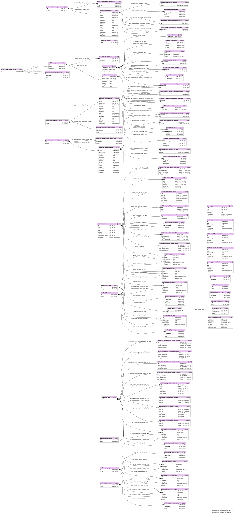

# The API for [StarDB](https://stardb.gg)

[](https://wakatime.com/badge/user/594e5948-2f7c-499b-955f-f57d579011fe/project/191bdf63-e366-4df1-8e42-10a802d4e404)

You can read API specifications at https://stardb.gg/api/swagger-ui/



## Developing

You need:

- [direnv](https://direnv.net)
- [devenv](https://devenv.sh)

```sh
cd stardb-api
devenv up
```

And you're ready to go :D

## Testing with Docker

Install Docker, a stable Rust toolchain with Clippy, and the pinned SQLx CLI:

```sh
cargo install sqlx-cli --version 0.8.6 --locked --no-default-features --features postgres,rustls
scripts/test-db.sh start
scripts/test-db.sh migrate
scripts/test-db.sh test
```

`compose.test.yml` provides PostgreSQL 17 on localhost port 55432. The script uses
its own database URL and disables Compose's automatic `.env` loading; it does not
use the application's database. Override the port with `STARDB_TEST_DB_PORT` if
55432 is occupied. Test data lives in the `stardb-api-test` project's Docker volume.
DB-backed tests apply migrations before their fixtures and use distinct fixture IDs.

```sh
scripts/test-db.sh test gacha::          # Focused tests; forwards cargo test arguments
scripts/test-db.sh verify               # All-target check, full tests, Clippy, diff check
scripts/test-db.sh prepare              # Migrate and refresh .sqlx after SQL/schema changes
scripts/test-db.sh check-schema         # Verify .sqlx matches the migrated schema
scripts/test-db.sh stop                 # Stop PostgreSQL, retain test data
scripts/test-db.sh reset                # Delete ONLY this Compose project's test volume and restart
scripts/test-db.sh url                  # Print the isolated test database URL
```

After `reset`, run `migrate` before SQL tooling; DB-backed tests migrate themselves.
Commit `.sqlx` changes together with their queries. Clippy CI runs offline checks
and linting only; database tests and SQLx schema verification run locally with
these Docker commands. To run checks against a different test database, set
`DATABASE_URL` explicitly and run `scripts/verify-gacha.sh`; tests write fixture data.
